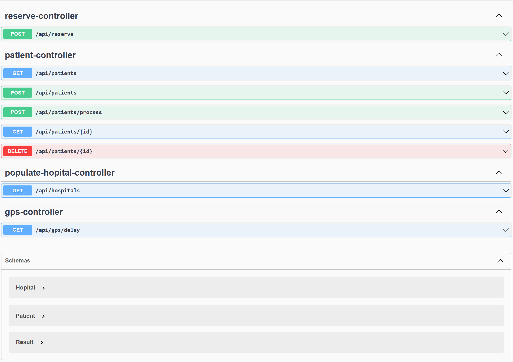
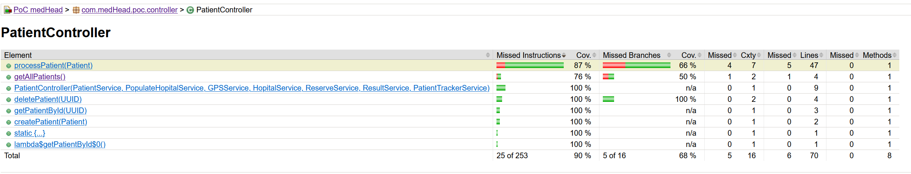
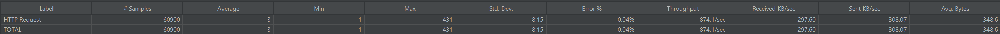
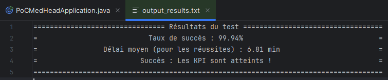

# Application web de PoC pour la réservation de lits d'hôpital


### **MedHead - Gestion des réservations hospitalières**
**Version actuelle :** v0.101  
**Statut du projet :** Fonctionnel, prêt pour intégration et tests utilisateurs.
---

## Table des Matières

- [Aperçu du Projet](#aperçu-du-projet)
- [Structure du Projet](#structure-du-projet)
- [Fonctionnalités](#fonctionnalités)
- [Prérequis](#prérequis)
- [Installation](#installation)
- [Exécution des Tests](#exécution-des-tests)
- [Déploiement](#déploiement)
- [Technologies Utilisées](#technologies-utilisées)
- [Contribution](#contribution)
- [License](#license)

---

## Aperçu du Projet

Ce projet est un Proof of Concept (PoC) visant à démontrer la faisabilité d'un système de réservation de lits hospitaliers avec les fonctionnalités suivantes :

- **Recherche de lits disponibles** pour une spécialité donnée.
- **Tri des hôpitaux** par proximité ou autres critères.
- **Validation des réservations** avec gestion en temps réel.
- **Simulation de trajets et gestion de la distance** entre patients et hôpitaux.


L'architecture du backend est basée sur **Spring Boot**. Les tests unitaires et d'intégration sont réalisés avec **JUnit** et **Mockito**. La documentation de l'API est disponible grâce à **Swagger**.
Le frontend est développé en **Angular**, utilisant des outils modernes pour une expérience utilisateur fluide et interactive :

> **Lien vers la documentation d'architecture associée :**  
> [OC_MedHead_ArchitecturalDocs](https://github.com/MickaelDP/OC_MedHead_ArchitecturalDocs)

---

## Structure du Projet

### **Backend**
- **`src/main/java/com/medHead/poc`** :
    - **`config`** : Configuration de Swagger, RestTemplate, Threading, etc.
    - **`controller`** : Contrôleurs REST pour gérer les endpoints (Patient, Hôpital, etc.).
    - **`entity`** : Entités principales utilisées dans le projet (Patient, Hôpital, Résultat).
    - **`model`** : Objets de transfert de données (DTOs) pour structurer les requêtes et réponses.
    - **`service`** : Contient la logique métier (gestion des patients, calcul des distances, etc.).
    - **`PoCMedHeadApplication`** : Classe principale pour lancer l'application Spring Boot.

### **Frontend - Angular** 
- **`src/main/angular/src/app`** :
    - **`ReservationComponent`** : Gère l'interface utilisateur et les réservations.
        - **`reservation.component.html`** : Contient le code HTML pour la présentation des réservations.
        - **`reservation.component.scss`** : Fichier SCSS pour le style visuel.
        - **`reservation.component.spec.ts`** : Fichier de test pour valider les comportements du composant.
        - **`reservation.component.ts`** : Logique principale du composant Angular.
- **`src/main/ressources/static`**:
    - Contient les fichiers HTML et CSS pré-rendus pour simuler une version statique ou fallback de l'interface Angular :
        - **`index.html`** : Page principale de l'interface.
        - **`styles-5INURTSO.css`** : Fichier CSS généré pour les styles de la version statique.
      - **Scripts front-end** :
          - **`main-UGH3R4YW.js`** : Fichier JavaScript principal.
          - **`polyfills-FFHMD2TL.js`** : Scripts pour assurer la compatibilité des fonctionnalités modernes.
        
### **Tests**
- **`src/test/java/com/medHead/poc`** :
- **Unitaires (`testUnitaire`)** :
    - Tests ciblant les entités et services (validation, logique métier).
- **Intégration (`testIntegration`)** :
    - Tests vérifiant les flux globaux entre les contrôleurs et les services.
    - Simulations de requêtes HTTP avec MockMvc.
- **Tests de Performance (`JMeter`)** :
    - Scénarios de tests de performance configurés via JMeter.
    - Fichiers inclus :
        - `HTTP Request.jmx` : Scénario de test pour les requêtes HTTP.
        - `HTTP Answer.jmx` : Réponses simulées pour valider les tests.
        - `output_results.txt` : Résultats du test HTTP Answer avec des indicateurs de performance.

## Ressources

Voici les ressources et fichiers spécifiques inclus dans le projet pour répondre aux besoins de simulation et de configuration :

- **`resources/static`** :
    - `index.html` : Fichier de test statique (placeholder pour le frontend Angular).

- **`resources`** :
    - **Configuration HTTPS** :
        - `keystore.p12` : Keystore contenant le certificat auto-signé pour HTTPS.
        - `selfsigned.crt` : Certificat auto-signé pour usage local.
    - **Données et Collections** :
        - `specialities.json` : Spécialités médicales simulées pour le projet.
        - `MedHead API.postman_collection.json` : Collection Postman pour tester les endpoints.
    - **Configuration Applicative** :
        - `application.properties` : Fichier de configuration principale pour Spring Boot.

---

## Fonctionnalités

1. **Recherche de Services** :
    - Permet de lister les hôpitaux offrant une spécialité spécifique.
2. **Réservation de Lit** :
    - Sélectionne l'hôpital le plus proche avec un lit disponible et confirme la réservation.
3. **Gestion de Proximité** :
    - Calcule automatiquement la distance et le temps de trajet vers les hôpitaux pertinents.
4. **Documentation de l'API** :
    - Disponible via Swagger à l'adresse `https://localhost:8443/swagger-ui.html`.
5. **Simulation de Résultat** :
    - Génère des résultats pour suivre les interactions (patient, hôpital, lit réservé, etc.).

---

## Prérequis

Avant de cloner et exécuter le projet, assurez-vous d'avoir installé :

- **Java 21** (compatible avec Spring Boot 3).
- **Maven** (pour la gestion des dépendances backend).
- **Postman** (pour tester les endpoints REST via la collection fournie).
- **Git** (pour cloner le dépôt).
- **JMeter** (pour exécuter les tests de performance).
- **Node.js** (v16 ou supérieur) : Nécessaire pour exécuter Angular et installer les dépendances.
- **npm** (v8 ou supérieur) : Gestionnaire de paquets pour installer les bibliothèques Angular.
- **Angular CLI** (v15 ou supérieur) : Outil en ligne de commande pour créer, développer et déployer des applications Angular.
- **Navigateur moderne** : Chrome, Firefox ou Edge pour garantir une compatibilité optimale avec les technologies modernes utilisées dans le frontend.

---

## Installation

### Cloner le Dépôt
    git clone https://github.com/votre-utilisateur/medHead-hospital-reservation-poc.git 
    cd medHead-hospital-reservation-poc

### Backend : Spring Boot

1. Configurer les dépendances :
  - Utiliser Maven pour installer les dépendances :
    ```bash
    mvn clean install
2. Lancer l'application :
	```bash
    mvn spring-boot:run
3. Accéder à l'API :
      ```bash
      Swagger UI : https://localhost:8443/swagger-ui.html
      Documentation JSON : https://localhost:8443/v3/api-docs
   


### Frontend : Angular
1. Installer les dépendances Angular :
	  ```bash
	cd src/main/angular
	npm instal
2. Lancer le serveur de développement Angular :
   ```bash
   ng serve
3. **Accéder à l'application Angular** :
    - L'application lancée avec Angular sera disponible à l'adresse suivante :
        - [`http://localhost:4200`](http://localhost:4200) (serveur de développement Angular).
        - Pour tester l'intégration complète avec le backend sécurisé, accédez à :
          [`https://localhost:8443`](https://localhost:8443) (nécessite HTTPS activé et configuration backend prête).
> **Note** : Assurez-vous que le backend Spring Boot est en cours d'exécution pour bénéficier de toutes les fonctionnalités intégrées.

### Aperçu des Interfaces Utilisateur

1. **Interface principale**  
     
   L'écran d'accueil avec les informations du médecin et l'interface de réservation.

2. **Autocomplétion des services**  
     
   Une fonctionnalité dynamique pour suggérer automatiquement les spécialités disponibles.

3. **Réservation validée**  
     
   Une fois la réservation réussie, un récapitulatif est affiché, comprenant l'hôpital attribué et le délai estimé.

4. **Gestion des erreurs**  
     
   Lorsqu'une spécialité est invalide ou non disponible, l'application propose une option de réservation en urgence générale.


### Base de Données 

Pour cette PoC, il est possible d'utiliser des données en mémoire pour simuler les hôpitaux et les réservations.

## Exécution des Tests

1. **Tests Unitaires et Mocking avec JUnit et Mockito** :
   - Exécuter les tests :
   ```bash
   mvn test
2. **Couverture des Tests avec Jacoco :**
    - Lancer les tests avec génération du rapport de couverture :
      
      ```bash
      mvn clean verify
   Rapport disponible ici : **`target/site/jacoco/index.html`**

   - Lancer les tests avec génération du rapport de couverture :
      
      ```bash
      target/site/jacoco/index.html
     
   

3. **Tests d'intégration :** 
   - Les tests d'intégration utilisent MockMvc pour simuler des requêtes HTTP réalistes.
4. **Tests de Performance avec JMeter** :
    - Configurer et exécuter les scénarios de performance avec des jeux de données générés :
        - Importer les fichiers JMeter (`HTTP Request.jmx`, `HTTP Answer.jmx`) dans JMeter.
        - **Configurer le chemin de sortie** dans **`HTTP Answer.jmx`** pour générer le fichier de résultats au bon emplacement.
        - Lancer le test et consulter le résultat dans **`output_results.txt`** et jmetter.
> **Note : Assurez-vous que maxport > 65000 pour éviter des problèmes de consommation excessive de ports.**




5. **Exécution du Pipeline CI/CD :** 
   - Utilisez Jenkins pour automatiser les tests et le déploiement continu.

## Déploiement

Voici les étapes pour déployer l'application en production (pour une application complète, ces étapes peuvent varier) :

1. **Pipeline CI/CD** :
   - Configuration dans Jenkins pour le déploiement continu. Voir le fichier Jenkinsfile dans le dépôt pour les détails.
2. **HTTPS** :
   - Fournir les certificats nécessaires (comme keystore.p12) pour activer HTTPS en production.
3. **Configuration** :
   - S'assurer que l'environnement respecte les configurations de sécurité mentionnées dans **`application.properties`**.

## Technologies Utilisées

### **Outils de Développement**
- **Maven** : Gestion des dépendances et automatisation des tâches pour le backend.
- **Git** : Contrôle de version pour la gestion des modifications du code source.
- **Postman** : Test manuel et validation des endpoints REST.
- **Node.js et npm** : Gestion des dépendances et exécution des scripts pour le frontend Angular.

### **Backend**
- **Java 21** : Langage principal pour l'implémentation des services backend.
- **Spring Boot** : Framework pour construire des applications RESTful robustes et extensibles.
- **Spring Data JPA** : Pour les interactions avec la base de données simulées dans ce PoC.
- **SpringDoc OpenAPI** : Génération et documentation des endpoints REST avec Swagger.

### **Frontend**
- **Angular 16** : Framework pour la création d'une interface utilisateur moderne, dynamique et responsive.
    - **SCSS** : Préprocesseur CSS pour la gestion des styles visuels.
    - **Angular CLI** : Outil pour la configuration, le développement et la compilation des projets Angular.
- **TypeScript** : Langage principal pour la logique frontend, offrant des fonctionnalités de typage statique.

### **CI/CD**
- **Jenkins** : Intégration continue et déploiement automatisé, avec pipelines configurés pour les tests et le déploiement.

### **Tests**
- **JUnit 5** : Framework principal pour les tests unitaires.
- **Mockito** : Outil de mocking pour simuler les dépendances dans les tests.
- **Jacoco** : Génération de rapports de couverture de tests.
- **MockMvc** : Simulation des requêtes HTTP pour les tests d'intégration.
- **JMeter** : Tests de performance pour mesurer les temps de réponse et la robustesse de l'application sous charge.

### **Autres outils et bibliothèques**
- **Swagger UI** : Interface utilisateur pour tester et documenter les endpoints REST.
- **ConcurrentHashMap** : Pour implémenter un cache concurrent dans le backend.
- **Keystore et certificats auto-signés** : Configuration HTTPS pour sécuriser les échanges avec l'API.

## Contribution

Merci de lire les fichiers suivants avant de contribuer :
- [Changelog.md](Changelog.md)
- [CONTRIBUTING.md](CONTRIBUTING.md)
- [CODE_OF_CONDUCT.md](CODE_OF_CONDUCT.md)

## License

Ce projet est sous licence MIT. Voir le fichier[LICENSE](LICENSE) pour plus de détails.
