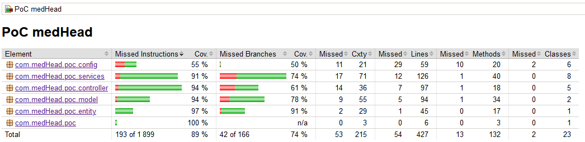

# Application web de PoC pour la réservation de lits d'hôpital

**Proof of Concept (PoC) pour la gestion de réservations de lits hospitaliers, intégrant des fonctionnalités de localisation, calcul de proximité et gestion des disponibilités.**

---

## Table des Matières

- [Aperçu du Projet](#aperçu-du-projet)
- [Structure du Projet](#structure-du-projet)
- [Fonctionnalités](#fonctionnalités)
- [Prérequis](#prérequis)
- [Installation](#installation)
- [Exécution des Tests](#exécution-des-tests)
- [Déploiement](#déploiement)
- [Technologies Utilisées](#technologies-utilisées)
- [Contribution](#contribution)
- [License](#license)

---

## Aperçu du Projet

Ce projet est un Proof of Concept (PoC) visant à démontrer la faisabilité d'un système de réservation de lits hospitaliers avec les fonctionnalités suivantes :

- **Recherche de lits disponibles** pour une spécialité donnée.
- **Tri des hôpitaux** par proximité ou autres critères.
- **Validation des réservations** avec gestion en temps réel.
- **Simulation de trajets et gestion de la distance** entre patients et hôpitaux.

L'architecture du backend est basée sur **Spring Boot**. Les tests unitaires et d'intégration sont réalisés avec **JUnit** et **Mockito**. La documentation de l'API est disponible grâce à **Swagger**.
> **Remarque** : Le frontend Angular est mentionné à titre indicatif et sera intégré dans les futures versions.

---

## Structure du Projet

### **Backend**
- **`src/main/java/com/medHead/poc`** :
    - **`config`** : Configuration de Swagger, RestTemplate, etc.
    - **`controller`** : Contrôleurs REST pour gérer les endpoints (Patient, Hôpital, etc.).
    - **`entity`** : Entités principales utilisées dans le projet (Patient, Hôpital, Résultat).
    - **`model`** : Objets de transfert de données (DTOs) pour structurer les requêtes et réponses.
    - **`service`** : Contient la logique métier (gestion des patients, calcul des distances, etc.).
    - **`PoCMedHeadApplication`** : Classe principale pour lancer l'application Spring Boot.

### **Tests**
- **`src/test/java/com/medHead/poc`** :
- **Unitaires (`testUnitaire`)** :
    - Tests ciblant les entités et services (validation, logique métier).
- **Intégration (`testIntegration`)** :
    - Tests vérifiant les flux globaux entre les contrôleurs et les services.
    - Simulations de requêtes HTTP avec MockMvc.

### **Frontend** *(à titre indicatif)*
- **`src/main/angular`** : Structure du frontend Angular prévue pour les futures versions.

---

## Fonctionnalités

1. **Recherche de Services** :
    - Permet de lister les hôpitaux offrant une spécialité spécifique.
2. **Réservation de Lit** :
    - Sélectionne l'hôpital le plus proche avec un lit disponible et confirme la réservation.
3. **Gestion de Proximité** :
    - Calcule automatiquement la distance et le temps de trajet vers les hôpitaux pertinents.
4. **Documentation de l'API** :
    - Disponible via Swagger à l'adresse `https://localhost:8443/swagger-ui.html`.
5. **Simulation de Résultat** :
    - Génère des résultats pour suivre les interactions (patient, hôpital, lit réservé, etc.).

---

## Prérequis

Avant de cloner et exécuter le projet, assurez-vous d'avoir installé :

- **Java 21** (compatible avec Spring Boot 3).
- **Maven** (pour la gestion des dépendances backend).
- **Postman** (pour tester les endpoints REST via la collection fournie).
- **Git** (pour cloner le dépôt).

*(Les outils pour le frontend, comme Node.js, npm, et Angular CLI, sont indiqués à titre indicatif pour les futures versions.)*

---

## Installation

### Cloner le Dépôt
    ```bash
    git clone https://github.com/votre-utilisateur/medHead-hospital-reservation-poc.git
    cd medHead-hospital-reservation-poc

### Backend : Spring Boot

1. Configurer les dépendances :
  - Utiliser Maven pour installer les dépendances :
	  ```bash
	   mvn clean install
2. Lancer l'application :
	```bash
   mvn spring-boot:run
3. Accéder à l'API :
      ```bash
      Swagger UI : https://localhost:8443/swagger-ui.html
      Documentation JSON : https://localhost:8443/v3/api-docs
   

### Frontend : Angular
1. Installer les dépendances Angular :
	  ```bash
	cd src/main/angular
	npm instal
2. Lancer le serveur de développement Angular :
   ```bash
   ng serve
### Base de Données 

Pour cette PoC, il est possible d'utiliser des données en mémoire pour simuler les hôpitaux et les réservations.

## Exécution des Tests

1. **Tests Unitaires et Mocking avec JUnit et Mockito** :
   - Exécuter les tests :
   ```bash
   mvn test
2. **Couverture des Tests avec Jacoco :**
    - Lancer les tests avec génération du rapport de couverture :
      ```bash
      mvn clean verify
   - Lancer les tests avec génération du rapport de couverture :
      ```bash
      target/site/jacoco/index.html
   
3. **Tests d'intégration :** 
   - Les tests d'intégration utilisent MockMvc pour simuler des requêtes HTTP réalistes.
4. **Tests de Performance (ex. avec JMeter) :**
   - Configurer et exécuter les scénarios de performance avec des jeux de données générés.

5. **Exécution du Pipeline CI/CD :** 
   - Utilisez Jenkins pour automatiser les tests et le déploiement continu.

## Déploiement

Voici les étapes pour déployer l'application en production (pour une application complète, ces étapes peuvent varier) :

1. **Pipeline CI/CD** :
   - Configuration dans Jenkins pour le déploiement continu. Voir le fichier Jenkinsfile dans le dépôt pour les détails.
2. **HTTPS** :
   - Fournir les certificats nécessaires (comme keystore.p12) pour activer HTTPS en production.
3. **Configuration** :
   - S'assurer que l'environnement respecte les configurations de sécurité mentionnées dans **`application.properties`**.
   
## Technologies Utilisées

- **Outils de développement:** **`Maven`**, **`Git`**,**`Postman`**.
- **Backend** : **`Java 21`**, **`Spring Boot`**.
- **Frontend** : **`Angular`**.
- **CI/CD** : **`Jenkins`**.
- **Tests** : **`JUnit 5`**, **`Mockito`** , **`Jacoco (couverture)`**, **`MockMvc`**, **`JMeter`**.

## Contribution

Merci de lire les fichiers suivants avant de contribuer :
- [Changelog.md](Changelog.md)
- [CONTRIBUTING.md](CONTRIBUTING.md)
- [CODE_OF_CONDUCT.md](CODE_OF_CONDUCT.md)

## License

Ce projet est sous licence MIT. Voir le fichier[LICENSE](LICENSE) pour plus de détails.
